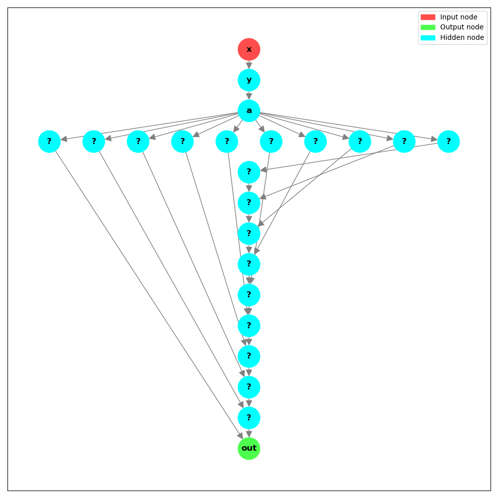
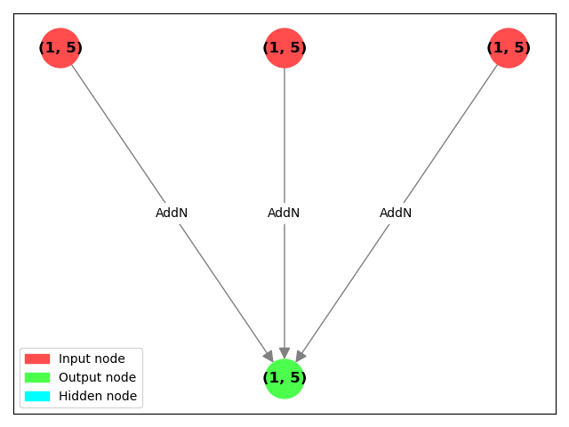

# Advanced stuff

## Underlying graphs

Deep neural networks can be represented as directed acyclic graphs where:

* nodes are inputs, outputs or intermediate states
* edges are layers (in general transformations or functions)

In such graph,
there exists a nonempty set of input nodes and a nonempty set of output nodes.
If your architecture meets the above conditions, it can be created in a symbolic manner.

When you create an `Input`, you create a node in the graph.

```python
from pytorch_symbolic import Input

x = Input(shape=(1,))
print(x)
```

```stdout
<SymbolicTensor at 0x7f2580812730; child of 0; parent of 0>
```

`Input` is a special instance of `SymbolicTensor`. There's nothing special about it.
In fact, you'll be able to use non-input `SymbolicTensor` as an input to your model.

In general, when you transform any `SymbolicTensor`, a new `SymbolicTensor` is created.

```py
y = x + 2
print(y)
```

```stdout
<SymbolicTensor at 0x7f252e166550; child of 1; parent of 0>
```

This _transformation_ is always just an `nn.Module`. Even when you use `+` or `-`.

These operators are just handy shortcuts for a module that adds two inputs.

```py
print(y.layer)
```

```stdout
AnyOpLayer()
```

When you add new nodes to the graph,
they will be registered as children of other nodes.
You can check children or parents of every node. For each node, you can run:

* `node.children: List[SymbolicTensor]`
* `node.parents: Tuple[SymbolicTensor, ...]`

It's possible to create new children, but it's impossible to modify parents.
Each operation on a `SymbolicNode` creates at leas one new child.
If your `nn.Module` has more than one output, more children will be created.
Usually modules have just one output:

```py
print(y)
a = y - 1
print(y)
b = y / 2
print(y)
```

```stdout
<SymbolicTensor at 0x7f252e166550; child of 1; parent of 0>
<SymbolicTensor at 0x7f252e166550; child of 1; parent of 1>
<SymbolicTensor at 0x7f252e166550; child of 1; parent of 2>
```

We created a bunch of children for `y`. Let's see them:

```py
print(y.children)
```

```stdout
[<SymbolicTensor at 0x7f252e170e80; child of 1; parent of 0>,
 <SymbolicTensor at 0x7f252e170ac0; child of 1; parent of 0>]
```

But if we are working with large graphs, it might not be very fun to inspect
the graph by printing children and parents to stdout. There is a nicer alternative though.

Pytorch Symbolic provides a basic graph drawing utility.
It will work only if you have optional dependencies installed:

* networkx
* matplotlib
* scipy

You can install them directly from pip `pip install pytorch-symbolic[full]`.

> If you don't have optional dependencies, you can use the package without drawing utility.

Let us draw our graph:

```py
from pytorch_symbolic import graph_algorithms

graph_algorithms.draw_graph(inputs=x, node_text_namespace=globals())
```


We use `node_text_namespace=globals()` so that Pytorch Symbolic will attempt
to display correct variable names on nodes.
It can be more difficult, e.g. when graph was defined in a local namespace.
Instead, you can use `node_text_func` to display anything you want.
It takes `SymbolicTensor` as input and returns `str` as output. By default, it displays tensor shape.

Be careful! It is not very refined, so it might not work well for large neural networks.
You can tune figure size and other stuff using matplotlib.

```py
import matplotlib.pyplot as plt

nodes = [a + i for i in range(10)]
out = sum(nodes)

plt.figure(figsize=(10, 10), constrained_layout=True)

graph_algorithms.draw_graph(
    inputs=x,
    outputs=out,
    edge_text_func=lambda x: "",
    node_text_namespace=globals(),
)
```



Use `edge_text_func` to display custom information on the edges.
By default it is name of the layer, e.g. `Linear` or `Conv2d`.

## Creating models

After creating Symbolic Tensors and defining the operations,
you want to enclose them in a model.
It might be a neural network or just an arbitrary graph of computations.
After creating `SymbolicModel` you will be able to use it with your own data.

```python
from torch import nn
from pytorch_symbolic import Input, SymbolicModel

inputs = x = Input((784,))

for _ in range(3):
    x = nn.Linear(x.features, 100)(x)

x = nn.Linear(x.features, 10)(x)
model = SymbolicModel(inputs, x)
```

You can use the plotting utility directly on your model.

```py
from pytorch_symbolic import graph_algorithms

graph_algorithms.draw_graph(model=model)
```


## Multiple inputs and outputs

If your `nn.Module` has multiple inputs or outputs, that's fine.

```python
from torch import nn
from pytorch_symbolic import Input, SymbolicModel, useful_layers, graph_algorithms

add_n = useful_layers.AnyOpLayer(op=lambda *args: sum(args))

inputs = [Input((5,)) for _ in range(5)]
intermediate = add_n(*inputs)
outputs = [intermediate / i for i in range(1, 5)]

model = SymbolicModel(inputs, outputs)
graph_algorithms.draw_graph(model=model)
```


Notice that we used custom `add_n` module here instead of just `sum(*symbolic_tensors)`.
In the end, they will produce equivalent models, but the underlying graph will be different.

Let us compare two examples:

```py
inputs = [Input((5,)) for _ in range(3)]
graph_algorithms.draw_graph(inputs=inputs, outputs=add_n(*inputs))
```



And:

```
graph_algorithms.draw_graph(inputs=inputs, outputs=sum(inputs))
```


That's because `sum` is in fact executing multiple `+` operations.

## Reusing existing layers

Each node except input is associated with some `nn.Module`.
When you are reusing a part of the graph, you are reusing underlying `nn.Module` too.
In fact, you can have multiple models sharing the same weights.
Or one model reusing the same weights multiple times.

For example, imagine you created a model that classifies RGB images:

```python
from torch import nn
from pytorch_symbolic import Input, SymbolicModel

inputs = x = Input((1, 28, 28))

for _ in range(3):
    x = nn.Conv2d(x.C, 8, 3, padding=1)(x)(nn.ReLU())

features = x

x = nn.Flatten()(x)
outputs = nn.Linear(x.features, 10)(x)

classifier = SymbolicModel(inputs, outputs)
print(classifier.output_shape)
```

```stdout
(None, 10)
```

After training `classifier`, you might decide that you want to inspect the intermediate features.

```py
feature_extractor = SymbolicModel(inputs, features)
print(feature_extractor.output_shape)
```

```stdout
(None, 8, 28, 28)
```

This model, `feature_extractor`, uses the same underlying weights
as already trained `classifier`,
but it outputs the intermediate features you want to inspect.
It does so without modifying the original model!

There's also another way of achieving similar effect, this one modifies the original model:

```py
classifier.add_output(features)
print(classificator.output_shape)
```

```stdout
((None, 10), (None, 8, 28, 28))
```

## Nested models

Instance of `SymbolicModel` is just an `nn.Module` and you should use it as such.
This means you can use it anywhere, including another `SymbolicModel` or vanilla model.
Create new models, using the existing ones.
Here we create a model that calculates how similar are two feature maps:

```py
import torch
from pytorch_symbolic import add_to_graph, graph_algorithms

inputs1 = Input((1, 32, 32))
inputs2 = Input((1, 64, 64))

noise = Input((1, 64, 64))

features1 = feature_extractor(inputs1)
features2 = feature_extractor(inputs2 + noise)
features2 = nn.MaxPool2d(2)(features2)

diffs = (features1 - features2) ** 2

outputs = add_to_graph(torch.sum, diffs, dim=(1, 2, 3))
strange_model = SymbolicModel((inputs1, inputs2, noise), outputs)

graph_algorithms.draw_graph(model=strange_model)
```


## Recreate Toy ResNet

We took an example of a toy ResNet from
[tensorflow guide](https://www.tensorflow.org/guide/keras/symbolic) and
recreated it in a few different ways. Note that their example is **16 lines long**,
excluding imports and utilities.

> In [benchmarks](benchmarks.md) you can see this model benchmarked!

Using Pytorch Symbolic, you can create toy ResNet using exactly as many lines as using Keras:

```python
from torch import nn
from pytorch_symbolic import Input, SymbolicModel

inputs = Input(shape=(3, 32, 32))
x = nn.Conv2d(inputs.C, 32, 3)(inputs)(nn.ReLU())
x = nn.Conv2d(x.C, 64, 3)(x)(nn.ReLU())
block_1_output = nn.MaxPool2d(3)(x)

x = nn.Conv2d(block_1_output.C, 64, 3, padding=1)(block_1_output)(nn.ReLU())
x = nn.Conv2d(x.C, 64, 3, padding=1)(x)(nn.ReLU())
block_2_output = x + block_1_output

x = nn.Conv2d(block_2_output.C, 64, 3, padding=1)(block_2_output)(nn.ReLU())
x = nn.Conv2d(x.C, 64, 3, padding=1)(x)(nn.ReLU())
block_3_output = x + block_2_output

x = nn.Conv2d(x.C, 64, 3)(block_3_output)(nn.ReLU())
x = nn.AvgPool2d(kernel_size=x.HW)(x)(nn.Flatten())
x = nn.Linear(x.features, 256)(x)(nn.ReLU())
x = nn.Dropout(0.5)(x)
outputs = nn.Linear(x.features, 10)(x)

model = SymbolicModel(inputs, outputs)
```

In fact, each line of code in Pytorch Symbolic and Keras is functionally equivalent. For example this line in
Keras:

```python
... = layers.Conv2D(64, 3, activation="relu", padding="same")(x)
```

is equivalent to this line in Pytorch Symbolic:

```python
... = nn.Conv2d(x.C, 64, 3, padding=1)(x)(nn.ReLU())
```

Let's analyze what happens the above lines:

* `nn.Conv2d` is PyTorch equivalent of Keras `layers.Conv2d` layer
* Input channels:
	* In Keras we don't pass it openly - it'll be calculated automatically from the inputs
	* In Pytorch Symbolic we also calculate it automatically using `x.C`, but we pass it openly as an argument
* In both frameworks `64, 3` is the number of output channels and size of the kernel
* Padding:
	* We use `padding="same"` in Keras
	* We use `padding=1` in PyTorch
* Activation:
	* In Keras we simply add an argument `activation='relu'`
	* in Pytorch Symbolic we add `nn.ReLU()` as a transformation that happens after `nn.Conv2d(...)`

The example below is equivalent, but uses another way of registering layers in the network:

```python
from torch import nn
from pytorch_symbolic import Input, SymbolicModel

inputs = Input(shape=(3, 32, 32))
x = inputs(nn.Conv2d(inputs.channels, 32, 3))(nn.ReLU())
x = x(nn.Conv2d(x.channels, 64, 3))(nn.ReLU())
block_1_output = x(nn.MaxPool2d(3))

x = block_1_output(nn.Conv2d(block_1_output.channels, 64, 3, padding=1))(nn.ReLU())
x = x(nn.Conv2d(x.channels, 64, 3, padding=1))(nn.ReLU())
block_2_output = x + block_1_output

x = block_2_output(nn.Conv2d(block_2_output.channels, 64, 3, padding=1))(nn.ReLU())
x = x(nn.Conv2d(x.channels, 64, 3, padding=1))(nn.ReLU())
block_3_output = x + block_2_output

x = block_3_output(nn.Conv2d(x.channels, 64, 3))(nn.ReLU())
x = x(nn.AvgPool2d(kernel_size=(x.H, x.W)))(nn.Flatten())
x = x(nn.Linear(x.features, 256))(nn.ReLU())
x = x(nn.Dropout(0.5))
outputs = x(nn.Linear(x.features, 10))

model = SymbolicModel(inputs, outputs)
```

This took 16 lines of code as well.

You can register new layers in whichever way you want or you can mix them.

### Vanilla PyTorch

A usual way to define the model in PyTorch is to create a class that inherits from `nn.Module`.

Steps:

1. define a class that inherits from `nn.Module`
2. define all the necessary layers in `__init__` method
	* You might have to calculate some things by hand: e.g. the number of input features for nn.Linear
3. define the order in which layers are executed in `forward` method

The separation of steps 2 and 3 often makes network creation tedious and more complicated than it should be.

PyTorch non-symbolic example (toy ResNet equivalent from previous section):

```python
from torch import nn


class ToyResNet(nn.Module):
    def __init__(self):
        super().__init__()
        self.relu = nn.ReLU()
        self.block1conv1 = nn.Conv2d(3, 32, 3)
        self.block1conv2 = nn.Conv2d(32, 64, 3)
        self.maxpool = nn.MaxPool2d(3)

        self.block2conv1 = nn.Conv2d(64, 64, 3, padding=1)
        self.block2conv2 = nn.Conv2d(64, 64, 3, padding=1)

        self.block3conv1 = nn.Conv2d(64, 64, 3, padding=1)
        self.block3conv2 = nn.Conv2d(64, 64, 3, padding=1)

        self.conv1 = nn.Conv2d(64, 64, 3)

        kernel_size = 7  # calculated by hand
        self.global_pool = nn.AvgPool2d(kernel_size)
        self.flatten = nn.Flatten()
        self.linear = nn.Linear(64, 256)
        self.dropout = nn.Dropout(0.5)
        self.classifier = nn.Linear(256, 10)

    def forward(self, x):
        x = self.relu(self.block1conv1(x))
        x = self.relu(self.block1conv2(x))
        block_1_output = self.maxpool(x)

        x = self.relu(self.block2conv1(block_1_output))
        x = self.relu(self.block2conv2(x))
        block_2_output = x + block_1_output

        x = self.relu(self.block3conv1(block_2_output))
        x = self.relu(self.block3conv2(x))
        block_3_output = x + block_2_output

        x = self.relu(self.conv1(block_3_output))
        x = self.global_pool(x)
        x = self.flatten(x)
        x = self.relu(self.linear(x))
        x = self.dropout(x)
        return self.classifier(x)


model = ToyResNet()
```

This took over 30 lines of code.

## References

* [https://www.tensorflow.org/guide/keras/functional](https://www.tensorflow.org/guide/keras/functional)